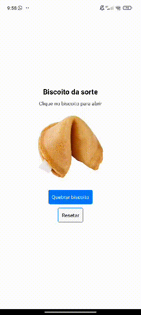

# App Biscoito da Sorte

Este é um aplicativo React Native que simula um "Biscoito da Sorte". Ele exibe frases motivacionais aleatórias ao tocar em um botão e permite resetar o biscoito para o estado original.

## Funcionalidades
- Exibe um biscoito fechado inicialmente.
- Ao tocar no botão "Quebrar Biscoito", uma frase motivacional é exibida e a imagem muda para um biscoito aberto.
- O botão "Resetar" retorna o biscoito ao estado original.

